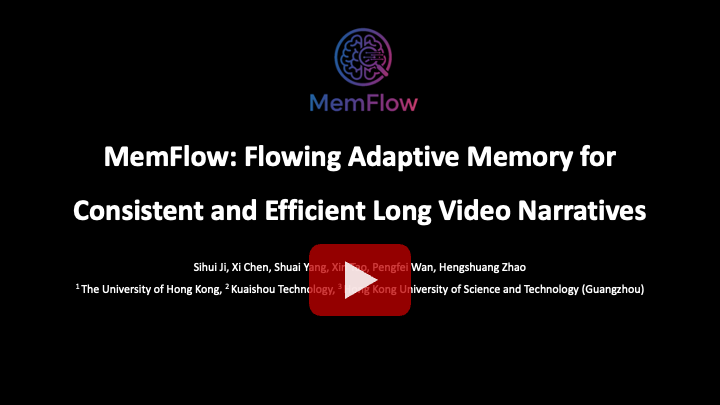

<p align="center" >
    
</p>

# <div align="center" >Flowing Adaptive Memory for Consistent and Efficient Long Video Narratives<div align="center">

<!-- ###  <div align="center"> SIGGRAPH Asia 2025 </div> -->
<div align="center">
  <p>
    <a href="https://sihuiji.github.io/">Sihui Ji</a><sup>1</sup>
    <a href="https://xavierchen34.github.io/">Xi Chen</a><sup>1</sup>
    <a href="https://andysonys.github.io/">Shuai Yang</a><sup>3</sup>
    <a href="https://www.xtao.website/">Xin Tao</a><sup>2</sup>
    <a href="https://magicwpf.github.io/">Pengfei Wan</a><sup>2</sup><br>
    <!-- <a href="https://openreview.net/profile?id=~Di_ZHANG3">Di Zhang</a><sup>3</sup>
    <a href="https://openreview.net/profile?id=~Kun_Gai1">Kun Gai</a><sup>3</sup> -->
    <a href="https://hszhao.github.io/">Hengshuang Zhao</a><sup>1✉</sup>
  </p>
  <p>
    <sup>1</sup>The University of Hong Kong &nbsp;&nbsp;
    <sup>2</sup>Kling Team, Kuaishou Technology<br>
    <sup>3</sup>Hong Kong University of Science and Technology (Guangzhou) &nbsp;&nbsp;
    <!-- <sup>3</sup>HKUST(GZ) &nbsp;&nbsp; -->
    <sup>✉</sup>Corresponding author
  </p>
</div>
<p align="center">
  <a href='https://sihuiji.github.io/MemFlow.github.io/'></a>
  &nbsp;
  <a href='https://www.youtube.com/watch?v=QCVdOhD5vFs'></a>
  &nbsp;
  <a href="https://arxiv.org/abs/2512.14699"></a>
  &nbsp;
  <a href='https://huggingface.co/KlingTeam/MemFlow'></a>
</p>

<!-- **Note:** This open-source repository is intended to provide a reference implementation. Due to the difference in the underlying I2V model's performance, the open-source version may not achieve the same performance as the model in our paper.  -->

## 🔥 Updates
- __[2025.12.14]__: Training and inference code, [model checkpoints](https://huggingface.co/KlingTeam/MemFlow) are available.
<!-- - __[2025.09.25]__: [CamCloneMaster](https://arxiv.org/abs/2506.03140) has been accepted by SIGGRAPH Aisa 2025. -->
<!-- - __[2025.09.08]__: [CameraClone Dataset](https://huggingface.co/datasets/KwaiVGI/CameraClone-Dataset/) is avaliable. -->
- __[2025.12.14]__: Release the [project page](https://sihuiji.github.io/MemFlow.github.io/) and the [arXiv](https://arxiv.org/abs/2512.14699) version.

## 📷 Introduction
**TL;DR:** 
We propose MemFlow to address the core challenge of long-context consistency and narrative coherence in streaming video generation.
Specifically, before generating the coming chunk, we dynamically update the memory bank by retrieving the most relevant historical frames with the text prompt of this chunk. 
In addition, during generation, we only activate the most relevant tokens in the memory bank for each query in the attention layers, which effectively guarantees the generation efficiency. 
In this way, MemFlow achieves outstanding long-context consistency with negligible computation burden and keeps the compatibility with any streaming video generation model with KV cache. 


<div align="center">

[](https://www.youtube.com/watch?v=QCVdOhD5vFs)


</div>

## &#x1F4CC; Highlights

1. **Long Context Memory with Limited Capacity**: MemFlow maintains long-range memory for visual consistency with highly constrained capacity to guarantee lightweight computation and storage.

2. **Adaptive Retrieval for Narrative Coherence**: 
MemFlow dynamically retrieves the most relevant historical frames from memory with text prompt of the coming chunk to ensure narrative coherence.

3. **Efficient and Real-time Inference**: 
Memflow supports real-time generation with 18.7 FPS on a single H100 GPU, sacrificing only 7.9% speed compared to the memory-free baseline.


<!-- ## &#x1F304; Gallery -->


<!-- ## 📑 Open-source Plan

- [x] Inference code
- [x] Model checkpoints
- [x] Training code -->

## 🛠️ Installation
**Requirements**

We tested this repo on the following setup:
* Nvidia GPU with 80 GB memory (A100, and A800 are tested).
* Linux operating system.

Other hardware setup could also work but hasn't been tested.

**Environment**

Create a conda environment and install dependencies:
```
git clone https://github.com/KlingTeam/MemFlow
cd MemFlow
conda create -n memflow python=3.10 -y
conda activate memflow
conda install nvidia/label/cuda-12.4.1::cuda
conda install -c nvidia/label/cuda-12.4.1 cudatoolkit
pip install torch==2.8.0 torchvision==0.23.0 --index-url https://download.pytorch.org/whl/cu128
pip install -r requirements.txt
pip install flash-attn --no-build-isolation
```

## 🧱 Download Checkpoints

Download models using huggingface-cli:
``` sh
pip install "huggingface_hub[cli]"
huggingface-cli download Wan-AI/Wan2.1-T2V-1.3B --local-dir wan_models/Wan2.1-T2V-1.3B
huggingface-cli download KlingTeam/MemFlow --local-dir checkpoints
```
or using git:
``` sh
git lfs install
git clone https://huggingface.co/KlingTeam/MemFlow
```

## 🔑 Inference
<!-- **Download checkpoints** -->


**Single Prompt Video Generation**
```
bash inference.sh
```
**Interactive Long Video Generation**
```
bash interactive_inference.sh
```
**Hints for video prompt**

1. For each subject and background appearing in a video, maintaining consistent descriptions across different prompts within the same video greatly improves global coherence during prompt switches. See the example for the exact prompt set we used to produce some of our videos on the demo page.

2. MemFlow supports diverse interaction—action changes, introducing/removing objects, background shifts, and more. While large-scale continuous camera motions can be achieved through appropriate cinematic language (see [`prompts/interactive_example.jsonl`](prompts/interactive_example.jsonl)), rapid shot-to-shot transitions or fast cutscene-style edits are not supported.

## ⚙️ Training
**Download checkpoints**

Please follow [Self-Forcing](https://github.com/guandeh17/Self-Forcing) to download text prompts and ODE initialized checkpoint.

Download Wan2.1-T2V-14B as the teacher model.

```
huggingface-cli download Wan-AI/Wan2.1-T2V-14B --local-dir wan_models/Wan2.1-T2V-14B
```
 
**Stage 1: Self-Forcing Initialization for Memory Mechanism**
```
bash train_init.sh
```
**Stage 2: Streaming Long Tuning**
```
bash train_long.sh
```

**Hints for two stage training**

The `bank_size` is a tunable hyperparameter specified in [`configs/train_init.yaml`](configs/train_init.yaml) and [`configs/train_long.yaml`](configs/train_long.yaml). It controls the number of latent frames stored in the memory bank. When `bank_size` matches the number of latent frames of frame sink in [LongLive](https://github.com/NVlabs/LongLive) (as in our default setting), training can optionally start directly from Stage 2 (Streaming Long Tuning). Specifically, we initialize from the checkpoint [`longlive_base.pt`](https://huggingface.co/Efficient-Large-Model/LongLive-1.3B/blob/main/models/longlive_base.pt) obtained in Stage 1 of [LongLive](https://github.com/NVlabs/LongLive) and fine-tune only the LoRA parameters, which significantly improves training efficiency.


<!-- ## How to contribute
- Make sure to have git installed.
- Create your own [fork](https://github.com/NVlabs/LongLive/fork) of the project.
- Clone the repository on your local machine, using git clone and pasting the url of this project.
- Read both the `Requirements` and `Installation and Quick Guide` sections below.
- Commit and push your changes.
- Make a pull request when finished modifying the project. -->

## 🤗 Acknowledgement
- [LongLive](https://github.com/NVlabs/LongLive): the codebase we built upon. Thanks for their wonderful work.
- [Self-Forcing](https://github.com/guandeh17/Self-Forcing): the algorithm we built upon. Thanks for their wonderful work.
- [Wan](https://github.com/Wan-Video/Wan2.1): the base model we built upon. Thanks for their wonderful work.


## 🌟 Citation
Please leave us a star 🌟 and cite our paper if you find our work helpful.

```
@misc{ji2025memflow,
      title={MemFlow: Flowing Adaptive Memory for Consistent and Efficient Long Video Narratives}, 
      author={Ji, Sihui and Chen, Xi and Yang, Shuai and Tao, Xin and Wan, Pengfei and Zhao, Hengshuang},
      year={2025},
      eprint={2512.14699},
      archivePrefix={arXiv},
      primaryClass={cs.CV},
      url={https://arxiv.org/abs/2512.14699}, 
}
```